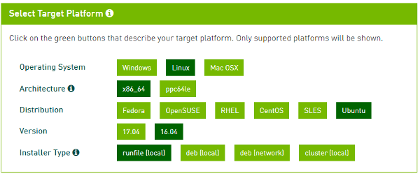

# Install CUDA & cuDNN:

If you want to use the __GPU version__ of the __TensorFlow__ you must have a __cuda-enabled GPU__.

* To check if your GPU is CUDA-enabled, try to find its name in the long [list of CUDA-enabled GPUs](https://developer.nvidia.com/cuda-gpus).
* To verify you have a CUDA-capable GPU:
  * __(for Windows)__ Open the command prompt (click start and write “cmd” on search bar) and type the following command:
  ```bash
  control /name Microsoft.DeviceManager
  ```
  * __(for Linux)__ Open terminal (Alt+Ctrl+T) and type:
  ```bash
  lspci | grep -i nvidia
  ```

You need to install CUDA and cuDNN with following versions:

- CUDA tooklit: 9.0
- cuDNN: 7.0.5

## Windows:

__1.__ Download and install the CUDA toolkit 9.0 from https://developer.nvidia.com/cuda-90-download-archive. Choose the correct version of your windows and select local installer:


Install the toolkit from downloaded .exe file.

__2.__ Download the cuDNN v7.0.5 (CUDA for Deep Neural Networks) library from [here](https://developer.nvidia.com/cudnn).
It will ask for setting up an account … (it is free)
Download cuDNN v7.0.5 for CUDA 9.0.

Choose the correct version of your Windows. Download the file. Copy the files to “C:\Program FIles\NVIDIA GPU Computing Toolkit\CUDA\v9.0” in the corresponding folders:


## Linux:

__1.__ Download and install the CUDA toolkit 9.0 from https://developer.nvidia.com/cuda-90-download-archive. Choose the correct version of your Linux and select runfile (local) local installer:


Open terminal (Alt+Ctrl+T) and type:
```bash
chmod +x cuda_9.0.176_384.81_linux.run
sudo ./cuda_9.0.176_384.81_linux.run --override
```
 __*Note:__ Do not install the Graphics Driver.

 You can verify the installation:
```bash
nvidia-smi
```
Also you can check where your cuda installation path (we will call it as ```<cuda_path>```) is using one of the commands:
```bash
which nvcc
ldconfig -p | grep cuda
```

Your ```<cuda_path>``` will be ```/usr/...``` or ```/usr/local/cuda/``` or ```/usr/local/cuda/cuda-9.0/```. Locate it and add it to your _.bashrc_ file:
```bash
export CUDA_ROOT=<cuda_path>/bin/
export LD_LIBRARY_PATH=<cuda_path>/lib64/
```

__2.__ Download the cuDNN v7.0.5 (CUDA for Deep Neural Networks) library from [here](https://developer.nvidia.com/cudnn).
It will ask for setting up an account … (it is free)
Download cuDNN v7.0.5 for CUDA 9.0.

Choose _cuDNN v7.0.5 Library for Linux_. Go to the folder that you downloaded the file and open terminal (Alt+Ctrl+T):
```bash
tar -xvzf cudnn-9.0-linux-x64-v7.tgz
cd cuda/
sudo cp -P include/cudnn.h <cuda_path>/include
sudo cp -P lib64/libcudnn* <cuda_path>/lib64
sudo chmod a+r <cuda_path>/lib64/libcudnn*
```

__3.__ Install libcupti-dev:
```bash
sudo apt-get install libcupti-dev
 ```
